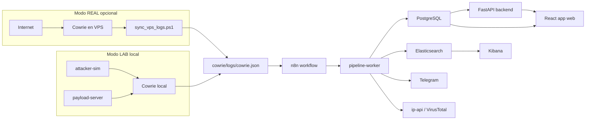
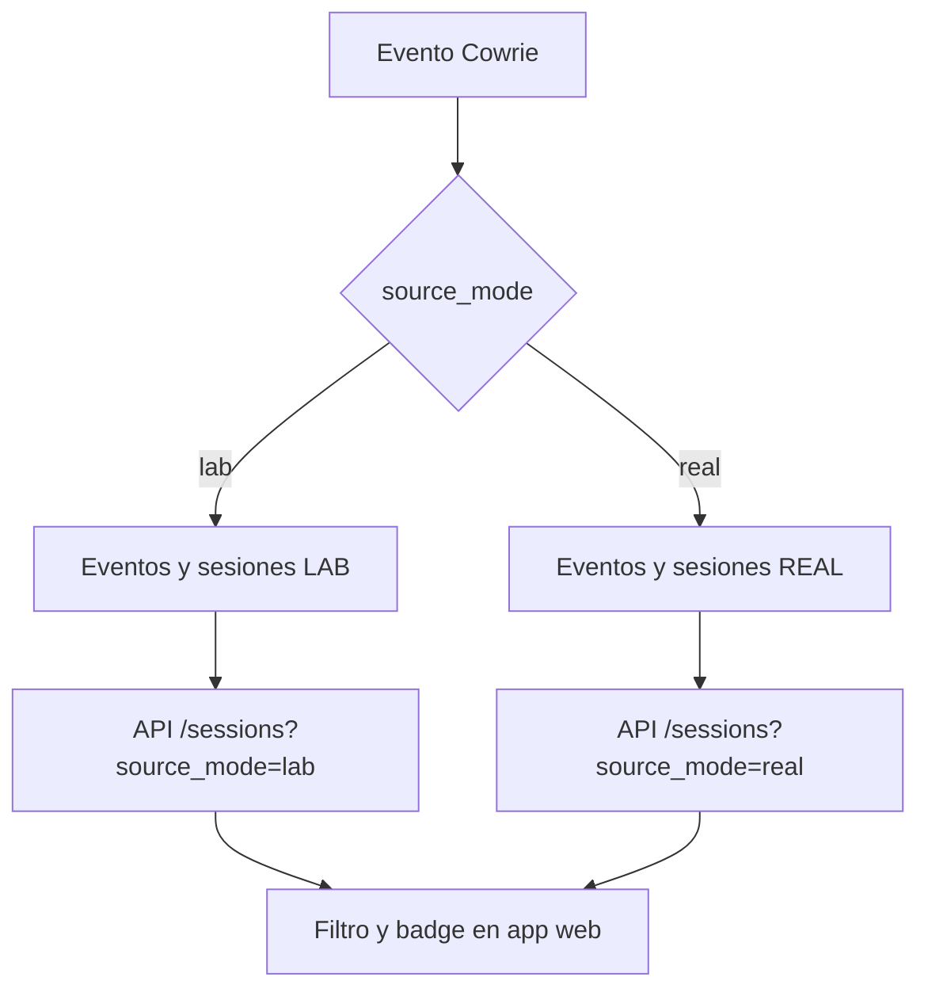
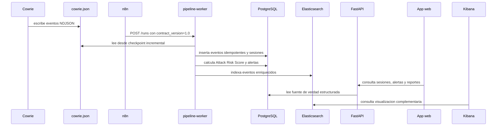

# Arquitectura final - OSCORP ThreatLab

Este documento consolida la arquitectura actual del proyecto despues de la
reestructuracion en dos modos: LAB local reproducible y REAL con VPS opcional.
El PDF viejo de tesis queda como referencia historica; esta arquitectura es la
fuente tecnica actual para actualizar la defensa y la tesis.

## Vista general

## Modos de operacion

### LAB

El modo LAB es la ruta principal de evaluacion academica. Levanta todo en la PC
local con Docker Compose, genera ataques inocuos con `attacker-sim`, produce
descargas internas desde `payload-server` y permite validar el sistema sin VPS,
sin internet real y sin costos externos.

### REAL

El modo REAL usa una VPS publica solo como sensor Cowrie. El procesamiento,
almacenamiento, alertas, dashboard y reportes siguen corriendo en la PC local.
Los logs se sincronizan con `scripts/sync_vps_logs.ps1` y se procesan con el
mismo pipeline usando `source_mode=real`.

## Separacion LAB / REAL

La separacion se implementa con:

- columna `source_mode` en `eventos` y `sessions`;
- constraint `CHECK (source_mode IN ('lab', 'real'))`;
- propagacion desde n8n y `pipeline-worker`;
- filtro API `?source_mode=lab|real`;
- badge y filtro visual en la app web.

## Componentes principales

| Componente | Funcion actual |
|---|---|
| Cowrie | Sensor SSH en LAB local o VPS REAL. |
| attacker-sim | Genera escenarios reproducibles de ataque en LAB. |
| payload-server | Sirve payloads inocuos dentro de Docker para pruebas locales. |
| n8n | Orquesta ejecuciones y llama al worker mediante contrato versionado. |
| pipeline-worker | Procesa NDJSON, checkpoints, sesiones, risk score, alertas y reportes. |
| PostgreSQL | Fuente de verdad estructurada: eventos, sesiones, usuarios, auditoria, alertas, reportes y checkpoints. |
| Elasticsearch | Indexacion y busqueda analitica de eventos. |
| Kibana | Visualizacion complementaria y exploracion analitica. |
| FastAPI | API autenticada para dashboard, sesiones, reportes, alertas, exportaciones y lab runner. |
| React | Interfaz principal de operacion y revision. |
| Telegram | Canal opcional de alertas. |

## Flujo de datos

## Garantias de reproducibilidad y seguridad

- Docker Compose con perfiles `lab`, `real` y `tools`.
- Migraciones Alembic hasta `0016_source_mode`.
- Dependencias Python pinneadas.
- Imagenes externas fijadas por digest SHA-256.
- Secretos reales fuera de git.
- Tests automatizados para backend, pipeline, frontend, seguridad y contratos.
- Backup/restore documentado.
- CI con lint, type-check, tests y migraciones en PostgreSQL limpio.

## Guias relacionadas

- `README.md`: uso operativo del LAB y modo REAL.
- `docs/arquitectura-local.md`: detalle del modo LAB.
- `docs/arquitectura-vps.md`: detalle del modo REAL/VPS.
- `docs/guia-demo.md`: recorrido de demostracion local.
- `docs/evidencias/fase39_diferencias_y_mapa_tesis.md`: diferencias con la tesis vieja y mapa de actualizacion.
